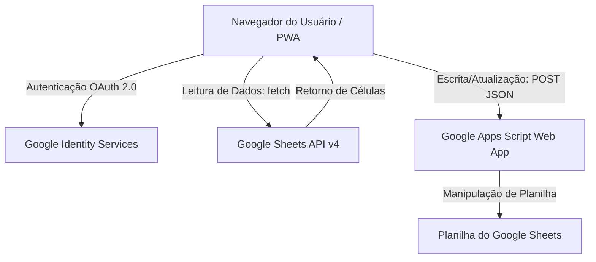
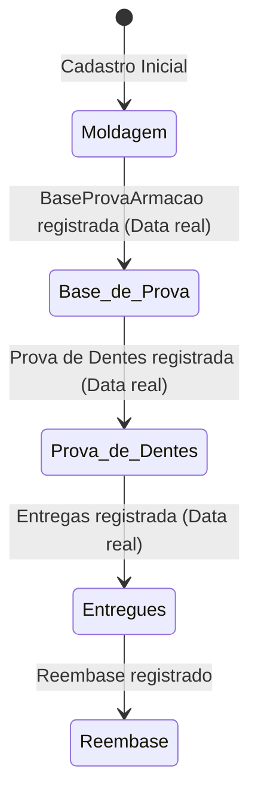

# Documentação Técnica do ProSUS v5.0
## Sistema de Controle de Próteses Dentárias do SUS

O **ProSUS** é uma aplicação do tipo *Single Page Application* (SPA) com capacidades de *Progressive Web App* (PWA) desenvolvida para gerenciar de ponta a ponta o fluxo de confecção, acompanhamento, remarcações e fechamentos financeiros de próteses dentárias (Prótese Total - PT e Prótese Parcial Removível - PPR) fornecidas pelo SUS.

Este documento fornece um detalhamento completo de sua arquitetura, fluxos de dados, componentes e regras de negócio.

---

## 1. Arquitetura Geral do Sistema

O sistema é construído sobre uma arquitetura serveless e sem banco de dados SQL/NoSQL tradicional. Em vez disso, ele aproveita o ecossistema do Google:



### Componentes de Integração
1. **Google Sheets API v4**: Utilizada para ler de forma rápida e segura dados da planilha. As requisições de leitura são enviadas do navegador do usuário utilizando o token de acesso (`accessToken`) obtido no login.
2. **Google Apps Script**: Um script web configurado com permissão para gravar na planilha. Ele expõe um endpoint público que recebe requisições `POST` da aplicação contendo comandos de inserção (`appendRow`) ou atualização (`update` em linha específica).
3. **PWA (PWA Manifest Inline)**: O manifesto está embarcado no próprio HTML em formato Blob de forma a permitir que a aplicação seja instalada diretamente em celulares (Android/iOS) e computadores, operando em tela cheia (standalone) e fornecendo atalhos rápidos.

---

## 2. Autenticação e Controle de Acesso (Google OAuth 2.0)

A autenticação é gerida pela biblioteca **Google Identity Services (GSI)**.

### Fluxo de Autenticação
* **Login Consensual**: O usuário clica em "Entrar com Google", o que dispara a função `signIn()`, solicitando consentimento para ler dados de perfil e escopos de acesso de leitura/escrita no Google Drive/Sheets.
* **Sessão Persistente (Login Silencioso)**: No carregamento (`onload`), a aplicação verifica se há um e-mail salvo em `localStorage`. Caso exista, realiza uma requisição silenciosa de token (`prompt: 'none'`) para evitar que o usuário precise logar manualmente a cada visita.
* **Escopos Necessários**:
  * `https://www.googleapis.com/auth/spreadsheets`: Para leitura de planilhas.
  * `https://www.googleapis.com/auth/userinfo.email`: Para verificação do usuário.
  * `https://www.googleapis.com/auth/userinfo.profile`: Para carregar imagem de perfil e nome.

### Níveis de Permissão (Roles)
* **Visualizador (Read-Only)**: Usuário autenticado que não pertence à lista de administradores. Consegue navegar em todas as telas, porém todos os inputs e botões de gravação de dados ficam desabilitados (`disabled`).
* **Administrador (Admin)**: Usuários cujos e-mails estão cadastrados na aba `Configuracao` (coluna B). Possuem privilégios completos para cadastrar moldagens, alterar etapas, registrar datas, atualizar protéticos, dentistas, contratos e tipos de peças.

---

## 3. Estrutura da Planilha (Banco de Dados)

A planilha do Google Sheets possui 11 abas principais que atuam como coleções/tabelas relativas:

| Aba | Colunas Chave | Função |
| :--- | :--- | :--- |
| **Moldagens** | A: Código (ID), B: Nome, C: Dentista, D: Tipo, E: Data, F: Dist., G: Situação, H: Obs | Cadastro mestre do paciente e registro da moldagem inicial. |
| **BaseProvaArmacao** | A: Código, F: Previsão, G: Data, H: Obs | Registro do cumprimento da etapa de Base de Prova / Armação Metálica. |
| **Prova de Dentes** | A: Código, F: Previsão, G: Data, H: Obs | Registro da data prevista e efetiva do teste de dentes. |
| **Entregas** | A: Código, F: Previsão, G: Entrega, H: Obs | Registro do prazo previsto de entrega e da entrega física ao paciente. |
| **Reembase** | A: Código, F: Data, G: Obs | Registro de intervenções corretivas pós-entrega. |
| **Proteticos** | A: Código (Sigla), B: Nome, C: PagaArmacao (S/N) | Cadastro dos laboratórios/protéticos conveniados. |
| **Dentistas** | A: Nome Completo | Lista de cirurgiões-dentistas requisitantes. |
| **BaseDados** | A: Descrição da Peça, B: Qtde PT, C: Qtde PPR | Banco de pesos de dentes/peças para cálculos estatísticos. |
| **Contratos** | A: ID, B: Data Início, C: Data Fim, D: Reembase/mês, E: Peças Contratadas | Gestão de metas físicas e contratação de serviços por período. |
| **Configuracao** | A: Chave, B: Valor | Parâmetros do sistema (como `admin_emails`). |
| **Remarcacao** | A: Código, E: Etapa, F: Data, G: Obs | Histórico de reagendamentos de consultas de etapas. |

---

## 4. O Estado Global (`state`)

Os dados carregados do Google Sheets são normalizados e mantidos em memória no objeto global `state`:

```javascript
const state = {
  accessToken: null,
  tokenExpiry: null,
  user: null, // { email, name, picture }
  connected: false,
  moldagens: [],      // Array de moldagens principais
  baseProva: [],      // Registros de bases já executadas (com data)
  basePrevista: [],   // Registros apenas com previsão de base
  provaDentes: [],    // Registros de prova de dentes (com previsão e/ou data)
  entregas: [],       // Registros de entregas e previsões
  remarcacoes: [],    // Histórico de remarcações
  reembase: [],       // Registros de reembase efetuados
  proteticos: [],     // Cadastros de protéticos
  dentistas: [],      // Cadastros de dentistas
  tiposPeca: [],      // Tabela de pesos PT e PPR por tipo
  contratos: [],      // Lista de contratos cadastrados
  filtered: [],       // Cache da lista de moldagens após aplicar filtros ativos
  currentPage: 1,     // Controle de paginação da tabela
  perPage: 15,        // Itens por página
  currentDetailCod: null, // Código do paciente aberto no modal
  contratoAtivo: null // Contrato atualmente selecionado para estatísticas
};
```

---

## 5. Regras do Pipeline de Etapas (Kanban)

A tela de Etapas distribui os pacientes cadastrados em colunas com base no estado de conclusão das fases anteriores. Um paciente só pode pertencer a uma coluna por vez, calculada a partir dos seguintes critérios de conjuntos:



* **Etapa 1 - Moldagem**: Paciente possui registro na aba `Moldagens`, mas **não possui** registro de data real de Base de Prova na aba `BaseProvaArmacao`, e não está entregue.
* **Etapa 2 - Base de Prova**: Paciente possui data de Base de Prova registrada, mas **não possui** data real na aba `Prova de Dentes`, e não está entregue. Exibe a previsão de prova de dentes no card, se houver.
* **Etapa 3 - Prova de Dentes**: Paciente possui data de Prova de Dentes concluída registrada, mas **não possui** data de entrega real registrada na aba `Entregas`.
* **Etapa 4 - Entregue**: Paciente possui data de entrega preenchida na aba `Entregas`.
* **Etapa 5 - Reembase**: Paciente possui data de reembase registrada na aba `Reembase`.

---

## 6. Módulos e Lógicas Especiais da Interface

### 6.1 Agrupamento Inteligente de Pacientes (Múltiplos Tratamentos)
Para evitar registros duplicados de nomes ou bagunça na tela de consulta de pacientes que necessitam de mais de uma prótese ao mesmo tempo (ex: PT Superior e PPR Inferior), o sistema utiliza a função de agrupamento por **Código Base** (`baseCod`):
* Um código de tratamento é estruturado como `CódigoBase/Sufixo` (ex: `7457` e `7457/1`).
* A função `agruparPorPaciente()` reúne moldagens sob o mesmo Código Base.
* Na tela de **Consultar**, o paciente é exibido em uma linha principal única (o primeiro tratamento). Se houver mais tratamentos associados àquele paciente, é gerado um selo informativo (`2 tratamentos ▼`). Ao clicar nele, as linhas "filhas" (tratamentos adicionais) expandem logo abaixo.
* Na tela de **Nova Moldagem**, ao digitar o nome do paciente, a função `verificarNomeCadastro()` busca tratamentos ativos com aquele nome e sugere automaticamente o próximo sufixo incremental adequado (ex: se `7457` já existe, sugere `7457/1`).

### 6.2 Fechamento Mensal e de Armação (Exportação TSV)
Essas telas geram planilhas consolidadas de produção de peças para faturamento ou pagamento.
* **Lógica**: Agrupamento e soma das contagens de PT e PPR declaradas na aba `BaseDados` para cada entrega ou base concluída no mês de referência.
* **Exportação**: O botão **📋 Copiar Tabela** converte o elemento DOM `<table>` em uma cadeia de caracteres delimitada por tabulações (formato TSV), copiando-a para a área de transferência (`navigator.clipboard`). Isso permite que os administradores colem os dados diretamente no Excel ou no Google Sheets (Ctrl+V) mantendo a formatação tabular exata.

### 6.3 Lógica dos Botões Rápidos ("Registrar Hoje")
Para agilizar o trabalho diário dos dentistas/secretários, a interface possui botões de ação rápida `⚡ Registrar Hoje`.
1. Ao clicar no botão, a função `salvarHoje(cod, tipo, inputId)` é disparada.
2. Ela preenche o input correspondente no formato ISO (`YYYY-MM-DD`).
3. Em seguida, invoca `submitEtapaUnica(cod, tipo)` que executa o `POST` imediato de gravação para a planilha do Sheets correspondente à etapa (`bp`, `pd`, `ent`, `rb`).
4. O sistema exibe um aviso de carregamento ("Salvando..."), recarrega todos os dados da nuvem (`loadAll`) e reabre o modal na mesma aba e paciente, atualizando o estado visual instantaneamente.

---

## 7. Apêndice: Código Padrão para o Google Apps Script

Caso seja necessário recriar ou migrar o endpoint de gravação do sistema no Google Apps Script, utilize a estrutura abaixo (salva como Script de Planilha no menu *Extensões -> Apps Script* da Planilha e implantada como Web App com acesso configurado para *"Qualquer pessoa"*):

```javascript
function doPost(e) {
  try {
    var data = JSON.parse(e.postData.contents);
    var sheetName = data.sheet;
    var row = data.row;
    var values = data.values;
    var action = data.action; // 'update' para atualizar, null para anexar
    
    // Abre a planilha ativa do script
    var ss = SpreadsheetApp.getActiveSpreadsheet();
    var sheet = ss.getSheetByName(sheetName);
    if (!sheet) {
      throw new Error("Aba '" + sheetName + "' não encontrada na planilha.");
    }
    
    if (action === 'update') {
      if (!row || row < 1) {
        throw new Error("A linha informada para atualização é inválida: " + row);
      }
      // Alinha os dados na linha informada
      var range = sheet.getRange(row, 1, 1, values.length);
      range.setValues([values]);
      return ContentService.createTextOutput(JSON.stringify({
        success: true, 
        message: "Linha " + row + " atualizada com sucesso na aba " + sheetName
      })).setMimeType(ContentService.MimeType.JSON);
    } else {
      // Adiciona uma nova linha ao final da aba
      sheet.appendRow(values);
      return ContentService.createTextOutput(JSON.stringify({
        success: true, 
        message: "Dados inseridos com sucesso na aba " + sheetName
      })).setMimeType(ContentService.MimeType.JSON);
    }
  } catch (error) {
    return ContentService.createTextOutput(JSON.stringify({
      success: false, 
      error: error.toString()
    })).setMimeType(ContentService.MimeType.JSON);
  }
}

// Responde a requisições de preflight do navegador (CORS)
function doOptions(e) {
  return ContentService.createTextOutput("")
    .setMimeType(ContentService.MimeType.TEXT);
}
```


---

## 8. Identidade Visual (a partir da v5.0)

A partir da versão 5.0 o ProSUS adota uma identidade visual própria — moderna, clara e voltada ao uso diário em ambiente clínico.

### 8.1 Logomarca
- **Símbolo:** "Arco de Progresso" — um anel quase completo com um nó na extremidade, representando o acompanhamento e a conclusão das etapas (o coração do sistema). Símbolo abstrato e geométrico, **sem dente literal**.
- **Logotipo:** "ProSUS" em *Space Grotesk* 600, com "SUS" em teal.
- **Aplicação:** o símbolo aparece em caixa com gradiente teal→petróleo no login, na sidebar e na topbar mobile, e nos ícones do PWA (192/512 e apple-touch).
- O emoji de dente foi removido da marca; emojis remanescentes são apenas ícones funcionais de conteúdo (ex.: menu "Tipos de Peça").

### 8.2 Paleta de cores
| Papel | Token | Claro | Escuro |
| :--- | :--- | :--- | :--- |
| Primária (ações/sucesso) | `--accent` | #0D7D6E | #27A08E |
| Secundária (info/previsto) | `--accent2` | #13456A | #6FB0D6 |
| Atenção | `--accent3` | #B9791A | #DCA64B |
| Atrasado | `--accent4` | #C2542E | #E7825C |
| Fundo | `--bg` | #FBFDFC | #06202F |
| Superfície | `--surface` | #FFFFFF | #0C2C3B |
| Tinta (texto) | `--text` | #0B2A2C | #E7F1EF |

As cores são definidas em variáveis CSS (`:root` para o tema escuro e `body.light` para o claro), o que permite re-tematizar todo o app a partir de um único ponto.

### 8.3 Tipografia
- **Space Grotesk** — títulos, marca e números de destaque (KPIs).
- **Hanken Grotesk** — corpo, formulários, tabelas e botões.
- **Space Mono** — disponível para códigos de tratamento, IDs e datas.

### 8.4 Tema
- **Tema claro é o padrão** (recomendado para uso clínico); a alternância para o escuro permanece disponível e é persistida em `localStorage` (`prosus_theme`).
- A troca de tema desativa transições momentaneamente (classe `theme-switching`) para repintar as superfícies instantaneamente, evitando estados "presos".

---

## 9. Otimização para Tablet (Android)

A partir da v5.0 a interface é otimizada para uso em **tablet Android em modo retrato** (orientação travada em `portrait-primary` no manifest).

- **Layout sem sidebar fixa:** em telas até 1024px em retrato, a barra lateral dá lugar à **barra de navegação inferior** + topbar mobile (melhor alcance do polegar e melhor aproveitamento da largura).
- **Aproveitamento de espaço:** grids mais largos (4 KPIs por linha, gráficos em 2 colunas, colunas do pipeline com ~46vw), modais centralizados como cartão, barra inferior mais alta.
- **Alvos de toque:** botões, campos, seletores e itens de navegação com altura mínima de 44–48px via `@media (pointer:coarse)` — válido em qualquer orientação.
- Em **paisagem** (ex.: 1280×800) a sidebar tradicional é mantida, com alvos de toque ampliados.

---

## 10. Histórico de Versões

| Versão | Mudanças |
| :--- | :--- |
| **v5.0** | Nova identidade visual (paleta teal/petróleo, logomarca "Arco de Progresso", tipografia Space Grotesk + Hanken Grotesk). Tema claro como padrão. Otimização para tablet Android (retrato). Correção de bug de inicialização do OAuth (`tokenClient` em TDZ). |
| v4.50 | Redesign visual "SaaS Moderno" (paleta azul-índigo). |
| v4.49 | Versão base documentada. |

